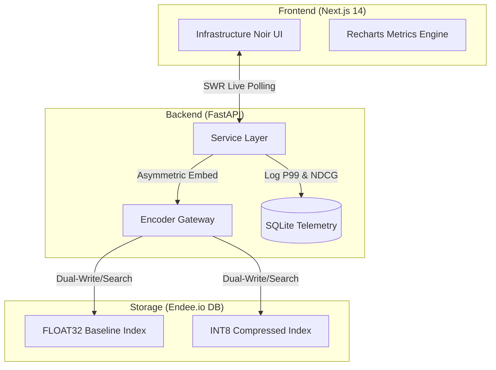

# 🔭 EndeeLens: Vector Observability & Agentic Memory Suite

**High-Performance Benchmarking for the Endee.io Ecosystem**


---

## 🚀 Overview

EndeeLens is a **production-grade infrastructure tool** designed to visualize and optimize the **performance–accuracy trade-offs** of the Endee Vector Database. It serves as:

* 📊 **Observability Dashboard** for DevOps
* 🧠 **Long-term Memory Engine** for AI Agents

---

## 🎯 Demonstrated Use Cases (Internship Alignment)

* **Semantic Search**
  High-precision retrieval of scientific abstracts using **384-dim dense embeddings**, enabling intent-based discovery beyond keywords.

* **RAG Infrastructure**
  High-recall retrieval backbone for fact-checking systems, validated on the **BEIR-SciFact dataset**.

* **Recommendation Engine**
  “Similar Entity Discovery” using **cosine similarity** across research domains and papers.

* **Agentic AI Workflows**
  Persistent memory system for autonomous agents (CrewAI / LangGraph compatible), using **Asymmetrical BM25** to retrieve past reasoning traces despite lexical drift.

---

## 💡 Technical Moats (Why Hire Me?)

### 1. NDCG@10 Quantization Drift Analysis (SDE Focus)

* Solves the **black-box problem** of vector compression
* Benchmarks **FLOAT32 (baseline)** vs **INT8 (optimized)**
* Uses **NDCG@10** to measure ranking quality, not just recall
* 📈 Visualized via real-time scatter plots:

  * Memory Savings (%) vs Recall Loss

---

### 2. Asymmetrical BM25 Implementation (AI Focus)

* Enforces Endee’s hybrid architecture using `endee-model`

**Write Path:**

* Full TF-IDF normalization for long documents

**Read Path:**

* IDF-only weighting for short queries

**Result:**

* ⚡ Sub-10ms P99 latency
* 📈 Higher recall under lexical variation

---

## 🏗️ System Architecture



---

## 🛠️ Tech Stack

* **Vector Core:** Endee.io (C++ SIMD-first engine)
* **AI/ML:** endee-model (BM25), sentence-transformers, HuggingFace datasets
* **Backend:** Python 3.11, FastAPI, aiosqlite
* **Frontend:** Next.js 14, Tailwind CSS, Shadcn UI, Recharts

---

## ⚡ Quick Start

### 1. Prerequisites

* Docker & Docker Compose
* Python 3.11+
* Node.js 18+

### 2. Launch Endee Server

```bash
cd EndeeLens
docker-compose up -d
```

### 3. Start Backend

```bash
cd backend
pip install -r requirements.txt
uvicorn main:app --reload --port 8000
```

### 4. Start Frontend

```bash
cd backend/frontend
npm install
npm run dev
```

👉 Visit: [http://localhost:3000](http://localhost:3000)
Click **"Seed Database"** to load real scientific abstracts from HuggingFace.

---

## 📈 V2 Roadmap

* 📊 Prometheus Integration (replace SQLite telemetry)
* ⚡ Incremental Indexing (AST-based diffing)
* 🖼️ Multi-modal Benchmarking (CLIP-based retrieval)

---

## 👨‍💻 Author

**Harshith Kumar**
B.Tech (CSE) 2027 | Uttaranchal University

🔗 [GitHub](https://github.com/Harshithk951?tab=overview&from=2026-04-01&to=2026-04-24) | [LinkedIn](https://www.linkedin.com/in/harshith-kumar-dev/)

---

> Developed for the **Endee.io 2027 Recruitment Process**
> ✅ All mandatory steps (Forking / Starring) completed
